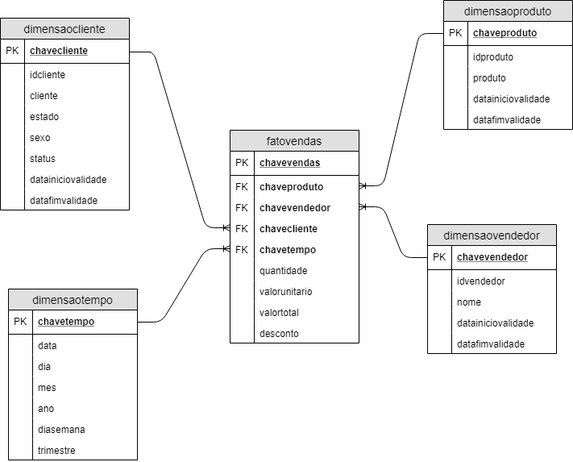

# Comandos para interagir com o Postgres #

## Banco de dados Dimensional Dataware House ##
O modelo Dimensional foi criado a partir do modelo relacional link do modelo relacinonal: https://github.com/Luistmz/Criando-Banco-relacional-Postgres

Todas as cargas de dados realizadas no modelo dimensional foram a partir das tabelas do modelo relacional

A carga realizado na Fato diz respeito a penas ao primeiro mês. Isso pode ser alterado trocando o valor ca clausula "Where" ou excluindo para carga total
 
Ambos foram criados dentro do meso database ed

### Logar no postgres ###
sudo -u postgres psql 

### listar bancos ###
\list

### Alterar banco de dados ###
- \c ed
Alterando do banco padrão do postgres para o banco ed

### Rodar os scripts externos de criação de tabela ###
- \i path do arquivo sql 
\i /workspace/downloads//8.CreateTable.sql
- comando SQL para criação das tabelas no modelo Dimensional. Nota: Não esquecer da chave substituta para o modelo dimensional 

## SQL ##
### CARREGAR OS DADOS DE CLIENTES (1ª CARGA) ###
WITH S AS (
     Select * From Relacional.Clientes order by idcliente
),
UPD AS (
     UPDATE Dimensional.DimensaoCliente T
     SET    DataFimValidade = current_date
     FROM   S
     WHERE  (T.IDCliente = S.IDCliente AND T.DataFimValidade is null) 
    		AND (T.CLIENTE <> S.CLIENTE OR T.ESTADO <> S.ESTADO OR T.SEXO <> S.SEXO OR T.STATUS <> S.STATUS)
     RETURNING T.IDCLIENTE
)
INSERT INTO Dimensional.DimensaoCliente(IDCliente, Cliente, Estado, Sexo, Status, DataInicioValidade, DataFimValidade)
SELECT IDCliente, Cliente, Estado, Sexo, Status, current_date, null FROM S
WHERE S.IDCliente IN (SELECT IDCliente FROM UPD) OR
	  S.IDCliente NOT IN (SELECT IDCliente FROM Dimensional.DimensaoCliente);

### CARREGAR OS DADOS DE PRODUTOS (1ª CARGA) ###
WITH S AS (
     Select * From Relacional.Produtos
),
UPD AS (
     UPDATE Dimensional.DimensaoProduto T
     SET    DataFimValidade = current_date
     FROM   S
     WHERE  (T.IDProduto = S.IDProduto AND T.DataFimValidade is null) 
    		AND (T.Produto <> S.Produto)
     RETURNING T.IDProduto
)
INSERT INTO Dimensional.DimensaoProduto(IDProduto, Produto, DataInicioValidade, DataFimValidade)
SELECT IDProduto, Produto, current_date, null FROM S
WHERE S.IDProduto IN (SELECT IDProduto FROM UPD) OR
	  S.IDProduto NOT IN (SELECT IDProduto FROM Dimensional.DimensaoProduto);

### CARREGAR OS DADOS DE VENDEDORES (1ª CARGA) ###
WITH S AS (
     Select * From Relacional.Vendedores
),
UPD AS (
     UPDATE Dimensional.DimensaoVendedor T
     SET    DataFimValidade = current_date
     FROM   S
     WHERE  (T.IDVendedor = S.IDVendedor AND T.DataFimValidade is null) 
    		AND (T.Nome <> S.Nome)
     RETURNING T.IDVendedor
)
INSERT INTO Dimensional.DimensaoVendedor(IDVendedor, Nome, DataInicioValidade, DataFimValidade)
SELECT IDVendedor, Nome, current_date, null FROM S
WHERE S.IDVendedor IN (SELECT IDVendedor FROM UPD) OR
	  S.IDVendedor NOT IN (SELECT IDVendedor FROM Dimensional.DimensaoVendedor);

### CARREGA SOMENTE O MÊS DE JANEIRO NA FATO VENDAS ###
INSERT INTO dimensional.fatovendas(chavevendedor, chavecliente, chaveproduto, chavetempo, quantidade, valorunitario, valortotal, desconto)
Select
	Vdd.ChaveVendedor,
    C.ChaveCliente,
    P.ChaveProduto,
    T.ChaveTempo,
    IV.Quantidade,
    IV.ValorUnitario,
    IV.ValorTotal,
    IV.Desconto
From Relacional.Vendas V
Inner Join Dimensional.DimensaoVendedor Vdd
	On V.IDVendedor = Vdd.IDVendedor And Vdd.DataFimValidade Is Null /*DataFimValidade Is Null representa o registro atual do Vendedor para a carga da fato no momento*/
Inner Join Relacional.ItensVenda IV
	On V.IDVenda = IV.IDVenda
Inner Join Dimensional.DimensaoCliente C
	On V.IDCliente = C.IDCliente And C.DataFimValidade Is Null /*DataFimValidade Is Null representa o registro atual do Cliente para a carga da fato no momento*/
Inner Join Dimensional.DimensaoProduto P
	On IV.IDProduto = P.IDProduto And P.DataFimValidade Is Null /*DataFimValidade Is Null representa o registro atual do Produto para a carga da fato no momento*/
Inner Join Dimensional.DimensaoTempo T
	On V.Data = T.Data
Where date_part('MONTH', V.DATA) = 01;

### Outros comandos ###
\q volta ao terminal do linux
\dt lista de tabelas

- BEGIN - transação aberta
- commit
- ROLLBACK -desfaz a ultima transação sem commit

### Schema da tabela ###
